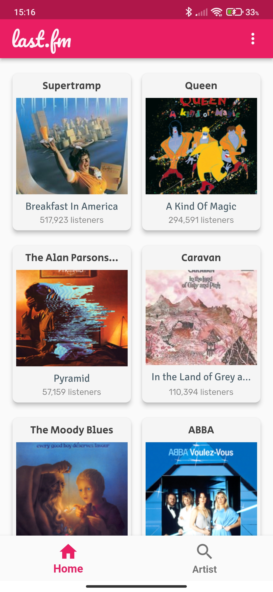
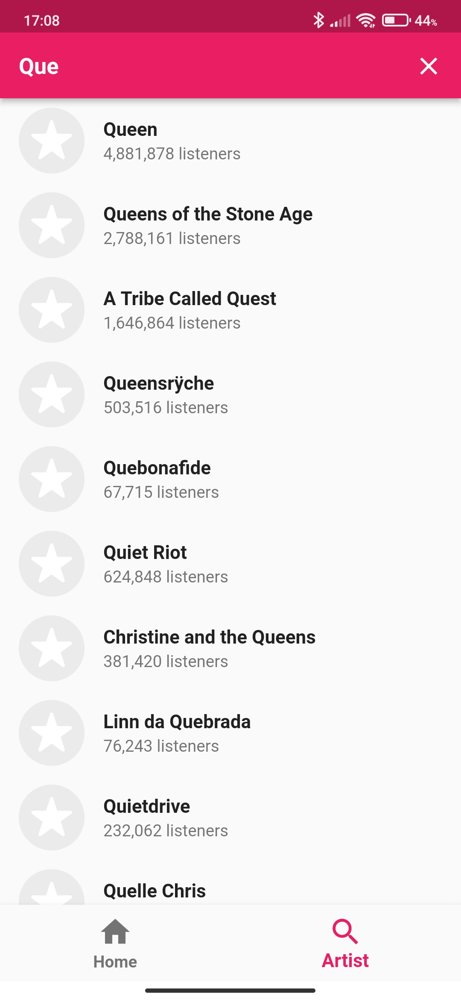
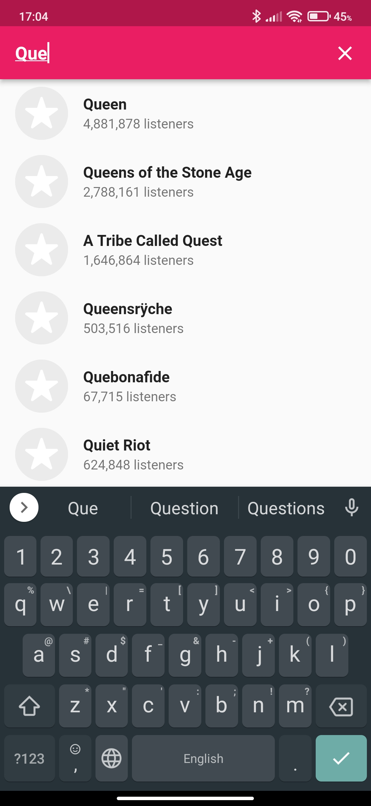
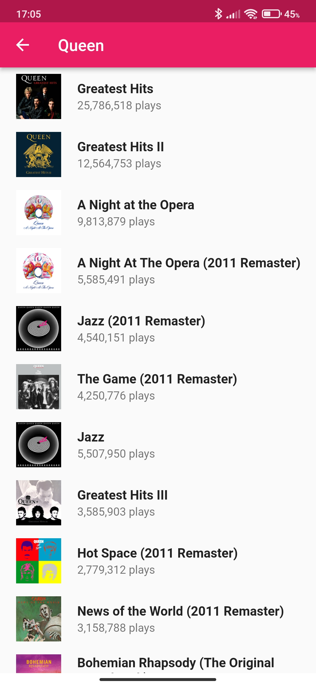
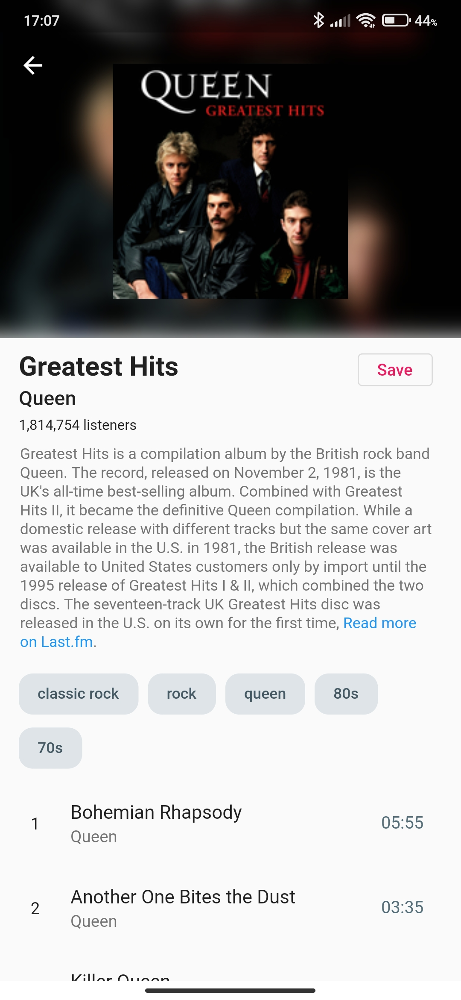
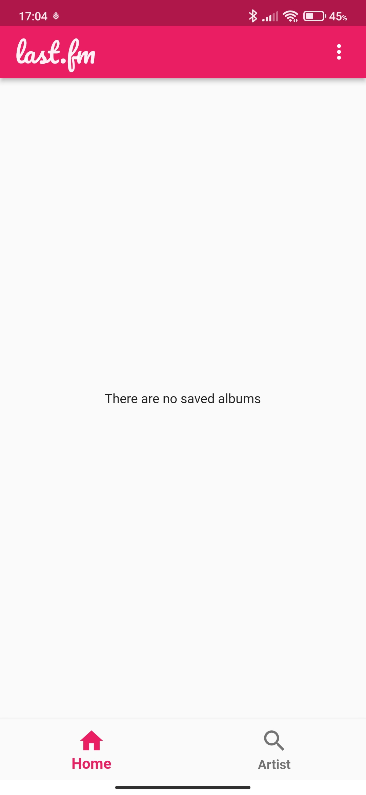

# Last fm project

A flutter project to demonstrate an author's approach to the Clean Architecture. The main advantage is a concise and easily understandable (at the same time maintainable and scalable) project structure. For more info - check my article here: [Part 1](https://medium.com/@eugelin7/thoughts-about-clean-architecture-in-flutter-apps-97cc0092078b) and [Part 2](https://medium.com/@eugelin7/b4d645265b51)

## Screenshots

 |  | 
--- | --- | ---
 |  | 

There is also a short video on Youtube about [how it works](https://youtu.be/JKbSkMCpuvc).
<br/><br/>

---
## API key

This app needs an API key from the "last.fm" service. You can get it [here](https://www.last.fm/api/authentication). After getting the key you need to create ".env" file in the project's root folder and put your key inside this file like this:

```shell
LastFmApiKey=YOUR_API_KEY
```

For more info you can check the documentation of the [flutter_dotenv](https://pub.dev/packages/flutter_dotenv) library.
<br/><br/>

---
## List of used libraries

  - dio
  - pretty_dio_logger
  - flutter_dotenv
  - equatable
  - bloc
  - flutter_bloc
  - get_it
  - intl
  - cached_network_image
  - go_router
  - flutter_html
  - url_launcher
  - provider
  - hive
  - hive_flutter
  - crypto
  - google_fonts
  - easy_debounce
  - flutter_native_splash
